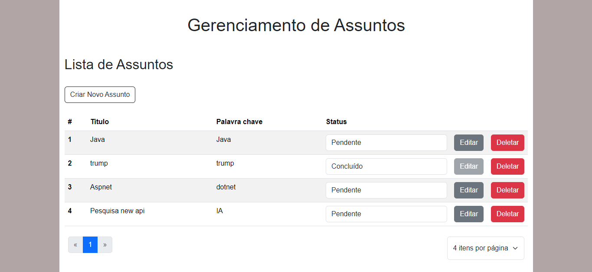
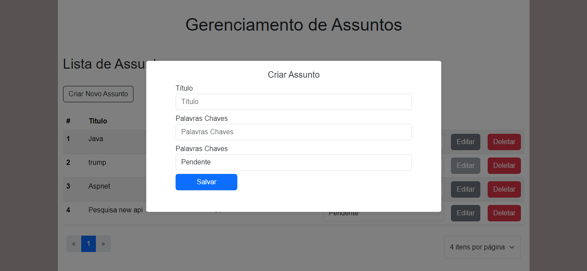
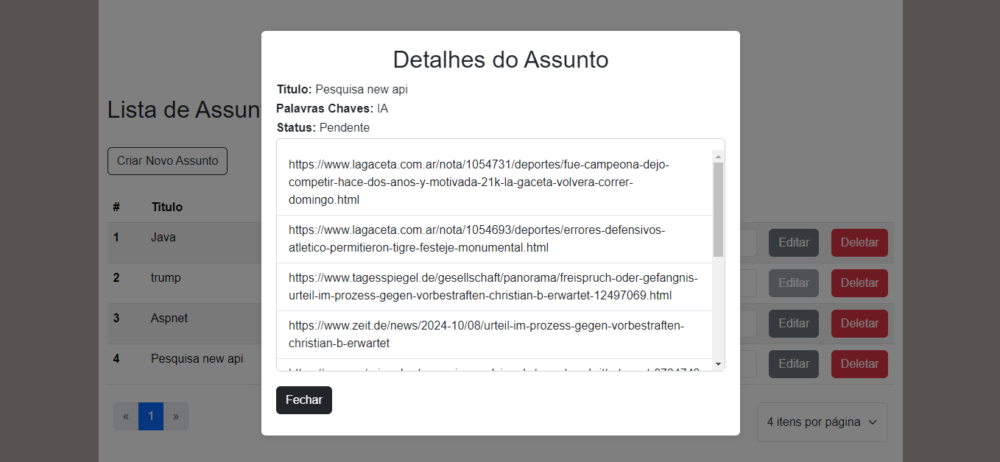

# Gerenciamento de Assuntos

## Descrição do Projeto
Esta aplicação web full-stack permite o gerenciamento de assuntos, proporcionando funcionalidades para criar, ler, atualizar e deletar assuntos. A aplicação tem a possibilidade de se integrar a duas APIs pública para exibir informações complementares relacionadas a cada assunto, como notícias relevantes. O backend é desenvolvido com Nest.js e o frontend com Angular.

## Instruções de Instalação e Execução

### Backend (Nest.js)

1. **Clone o repositório:**
   ```bash
   https://github.com/NailsonMello/gerenciamento-assuntos.git
   cd backend/subject-management
   ```

2. **Instale as dependências:**
   ```bash
   npm install
   ```

3. **Configure as variáveis de ambiente:**
   Crie um arquivo `.env` na raiz do diretório `backend` e adicione as seguintes variáveis:
   ```plaintext
    DB_HOST=10.0.0.116
    DB_PORT=5435  
    DB_USER=postgres
    DB_PASSWORD=gerenciamento
    DB_NAME=gerenciamentoassuntos
    API_KEY_NEWS_API=fadhjlhADDdsgKLASKALKDS
    TYPE_NEWS=NewsApi

   ```
    ```plaintext
    DB_HOST, DB_PORT, DB_USER, DB_PASSWORD e DB_NAME são configurações do banco
    API_KEY_NEWS_API chave api necessario para acessar os dados
    TYPE_NEWS é a api que o backend realizará a busca por noticias relacionadas
    ```

    **Busca de Notícias**

    É possivel realizar buscas de notícias com base no tipo especificado.

    ***Tipos de Notícias***

    - **TYPE_NEWS = NewsApi**: Se o tipo de notícia for `NewsApi`, a busca será realizada em: https://newsapi.org/v2/top-headlines
    
    - **TYPE_NEWS = Gdelt**: Se o tipo de notícia for `Gdelt`, a busca será realizada em: https://api.gdeltproject.org/api/v1/search_ftxtsearch/search_ftxtsearch


4. **Uso do banco de dados:**
   ```
   Caso queria utilizar o postgre rodando em um container docker, na raiz do projeto execute o comando via bash: docker-compose up -d
   ```

    ```
   Se não for utilizar o banco de dados em um container docker, você precisará criar o banco de dados: gerenciamentoassuntos
   ```

5. **Inicie o servidor:**
   ```bash
   npm run start:dev
   ```

### Frontend (Angular/React/Vue)

1. **Abra o repositório:**
   ```bash
   cd frontend/subject-management
   ```

2. **Instale as dependências:**
   ```bash
   npm install
   ```

3. **Configure as variáveis de ambiente (se aplicável):**
   Adicione as chaves necessárias no arquivo de configuração do frontend.

4. **Inicie o servidor:**
   ```bash
   npm start
   ```

## Tecnologias e Bibliotecas Utilizadas
- **Backend:**
  - Nest.js
  - TypeScript
  - TypeORM
  - PostgreSQL
  - Axios(para requisições HTTP)

- **Frontend:**
  - Angular/React/Vue
  - Bootstrap(para estilização)

## API Documentation
A documentação da API pode ser acessada através do Swagger. Após iniciar o servidor backend, você pode acessá-la em:
```
http://localhost:3000/swagger/docs
```

### Endpoints Disponíveis

#### Assuntos
- **GET /subjects**: Listar todos os assuntos.
- **GET /subjects/{id}**: Obter um assunto.
- **POST /subjects**: Criar um novo assunto.
- **PUT /subjects/{id}**: Atualizar um assunto existente.
- **DELETE /subjects/{id}**: Deletar um assunto.


## Screens
| | | |
|:-------------------------:|:-------------------------:|:-------------------------:|
|  Dashboard |   Modal para criar assuntos| Modal para editar assunto|
| Detalhes do Assunto |   Noticias relacionada ao assunto||
